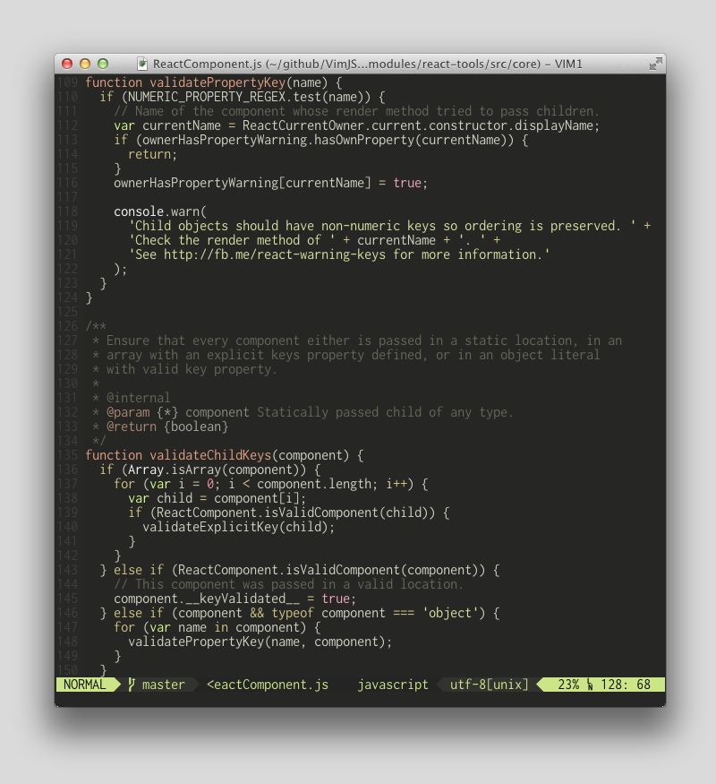
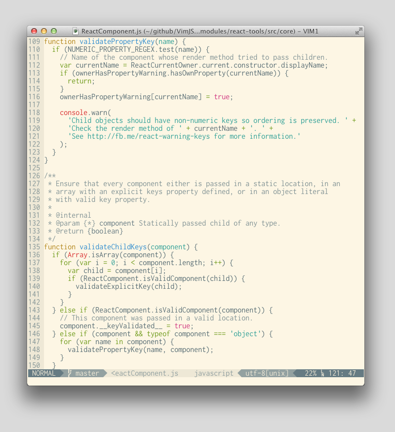

VimCleanColors
==============

Collection of Clean Vim ColorSchemes With Airline Themes.

**Lightbright Muted**

**Solarized Light**

`lightBright`/`lightBrightMuted` are originally designed. `solarizedLight` is
based on `https://github.com/altercation/solarized` but with visual cruft
removed so as to appear flat.

Every colorscheme has a powerline theme included.

*Usage:*

- `colorscheme lightBright`
- `colorscheme lightBrightMuted`
- `colorscheme solarizedLight`

`./colors/solarizedLight.vim` has its own license included in the file, but see
`LICENSE` for all others.
